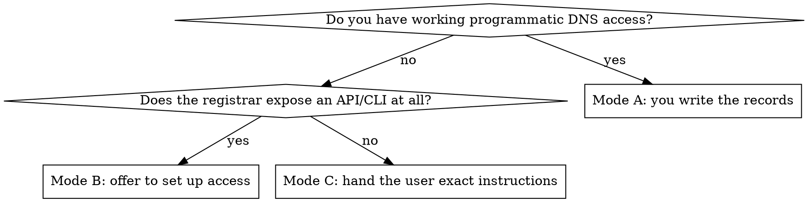

# DNS Cutover (Phase 3, step 2) — registrar-agnostic

Pointing a custom domain from the old host to Vercel. The registrar does not
matter; the decision that matters is **how much programmatic access you have**,
and **what else lives in that zone**.

**Treat every DNS write as outward-facing and irreversible-ish.** A wrong record
takes down a live site or, worse, silently kills inbound email for the whole
domain. Confirm with the user before writing, even when you hold credentials.

## Step 0 — Pick your access mode



Find the registrar and the *actual* DNS operator — they are often different
(domain registered at one company, nameservers delegated to another). The
nameservers are the truth:

```bash
dig +short <domain> NS
```

Match the NS answer against where you will make the change. Editing records at
the registrar while the zone is served by someone else's nameservers does
nothing, and it is a common hour-waster.

| NS answer contains | Zone is operated by |
|---|---|
| `*.cloudflare.com` | Cloudflare (records live in Cloudflare, not the registrar) |
| `*.vercel-dns.com` | Vercel (you can use `vercel dns` directly) |
| `*.awsdns-*` | Route 53 |
| `*.domaincontrol.com` | GoDaddy |
| `*.registrar-servers.com` | Namecheap |
| `*.googledomains.com` / `*.squarespacedns.com` | Squarespace (ex-Google Domains) |
| registrar's own brand | The registrar's panel/API |

**Mode A** — a CLI/API is configured and authenticated (a wrapper script, a
provider CLI, a token in the environment). Verify it can *read* first; a
successful read proves auth before you attempt a write.

**Mode B** — the provider has an API but it is not set up. Say so, name what
you would need (an API key with DNS scope), and let the user choose between
setting it up and doing it by hand. Do not stall the migration on this — Mode C
always works.

**Mode C** — no programmatic access. This is the *normal* case for most users
of this skill. Generate exact, copy-pasteable instructions (template at the
bottom) and wait for the user to confirm they applied them. Never guess whether
they did — verify with `dig`.

## Step 1 — Inventory the whole zone BEFORE touching anything

Never write a record you have not first read the neighbourhood of.

```bash
# Whole-zone view via the authoritative nameserver (bypasses caches).
NS=$(dig +short <domain> NS | head -1)
for t in A AAAA CNAME MX TXT NS CAA; do
  echo "--- $t ---"; dig +short <domain> $t @"$NS"
done
dig +short www.<domain> A @"$NS"; dig +short www.<domain> CNAME @"$NS"
dig +short _dmarc.<domain> TXT @"$NS"
```

Save the output. It is your rollback plan and your blast-radius map.

Record explicitly, before proceeding:
- **Current apex A value** (Replit's edge is `34.111.179.208`) — this is what you
  restore on rollback.
- **Every mail-related record** — see the blast-radius rule below.

## Step 2 — The blast-radius rule

A web cutover changes **only** the address records for the web hostnames:
`A`/`AAAA`/`CNAME` on the apex and `www` (and any other web subdomain).

**Never modify or delete these while doing a web cutover:**

| Record | Looks like | Breaks if you touch it |
|---|---|---|
| **apex `NS`** | the zone's own nameservers | **The entire domain — site and mail.** Worse than any mail record |
| `MX` | `mx1.<provider>.com` | All inbound email, immediately |
| SPF `TXT` | `v=spf1 include:... -all` | Outbound mail starts failing spam checks |
| DKIM `TXT` | `<selector>._domainkey` | Outbound mail signature verification |
| DMARC `TXT` | `_dmarc` | Mail policy / reporting |
| Verification `TXT` | `google-site-verification=`, `MS=`, `<vendor>-verify=` | Loses proof of domain ownership — sometimes unrecoverable |
| `CAA` | `0 issue "letsencrypt.org"` | Can block Vercel's cert from issuing — read it, don't delete it |

Web hosting and email are independent. Moving a site between hosts should never
require a mail record change. If a plan seems to, the plan is wrong.

**The apex `NS` records are the trap that looks most like junk.** In a zone
you have been told is full of cruft, two `NS` records pointing at the provider
you are migrating *away from* read as obvious leftovers. They are not — they are
the delegation that makes the zone resolve at all. Deleting them takes the whole
domain down. Nameservers change only via the registrar's delegation settings,
never by editing records in the zone.

One `CAA` note: if a `CAA` record exists and does not authorise Let's Encrypt,
Vercel's certificate will fail to issue no matter how correct the `A` record is.
Read it during inventory; if it blocks issuance, that is a deliberate addition
to discuss with the user, not a record to silently remove.

### Trap: nameserver delegation moves EVERYTHING

Vercel will offer "change your nameservers to `ns1/ns2.vercel-dns.com`" as an
alternative to setting an A record. That is not a smaller change — it is a
larger one. Delegating nameservers moves the **entire zone**, so every MX, SPF,
DKIM, DMARC, and verification record must be recreated in Vercel DNS or it
simply stops existing. Mail dies at propagation.

**Default to editing a single A record at the existing DNS operator.** Only
delegate nameservers when the zone has no mail and no other records worth
keeping, and only after the user agrees.

### Trap: write granularity on multi-valued records

Many registrar APIs and CLI wrappers address records by **(host, type)** and
have no way to target one record among several of the same type. A domain
typically has three or more TXT records at the apex (SPF + several vendor
verifications).

**This applies to writes, not just deletes:**

- `del <host> <type>` removes **every** record of that type at that name. A
  "delete the stale TXT" command takes SPF and every verification with it.
- `set <host> <type> <value>` on a name that holds several records of that type
  is equally ambiguous — it may update one, or collapse all of them into one.
  You usually cannot tell from the interface, and guessing wrong destroys the
  same records `del` would. A delete-then-restore sequence is *not* a safe
  workaround; it relies on exactly the behaviour you could not confirm.
- `MX` needs a priority field. If the tool's `set` signature has no slot for
  one, MX writes are unrepresentable through it — a second, independent reason
  to stay away from mail records with that tool.

**The rule: before any write or delete against a (host, type) that holds more
than one record, establish that the tool can target a single record.** Check
`--help`, or read the zone and confirm the interface exposes an id or value
selector. If it cannot, do not touch that name with that tool.

Changing the apex `A` is safe under this rule precisely because there is exactly
one `A` record — the ambiguity does not arise. That is the change you came to
make; make only that one.

### What to do about genuinely stale records

Refusing the delete is correct, but "leave it" alone reads as a dodge to a user
who explicitly asked for cleanup. Give them the real answer:

A stale verification `TXT` (e.g. `replit-verify=…`) **is** safe to remove — but
only with a tool that selects by value or record id (the registrar's web panel,
or an API exposing record IDs), and only **after** cutover is verified. It is a
separate, unhurried task, not part of the cutover.

So: name which record is genuinely dead, explain that this tool cannot remove it
without collateral, and offer the value-selective path as a later step. What you
must not do is perform the destructive delete because cleanup was requested. A
stale record costs a few bytes in a DNS response; a deleted SPF record is a live
mail incident.

## Step 3 — Lower the TTL first (optional but cheap)

Write the **same value** with a shorter TTL, one old-TTL-period before the
cutover — ideally a day ahead:

```
<apex>  A  <current old value>  TTL 300
```

Nothing changes for visitors; rollback becomes 5 minutes instead of hours.

**It only helps if you then wait out the OLD TTL before Step 5.** Resolvers that
already cached the record keep serving it for up to the old TTL regardless of
what you just wrote. Lowering the TTL and cutting over immediately buys nothing.

So it is a straight either/or, and the user is usually in a hurry:

| Situation | Do this |
|---|---|
| You can wait out the old TTL (e.g. 1h) | Lower TTL, wait, then cut over — rollback is ~5 min |
| You cannot wait | **Skip this step**, cut over now, accept that a bad cutover takes up to the old TTL to undo |
| Existing TTL already ≤300 | Skip — nothing to gain |

Say which branch you took and what the rollback window therefore is. Do not
present TTL-lowering as a prerequisite; it is insurance, and a user who cannot
wait for it should still be able to cut over.

## Step 4 — Attach the domain in Vercel BEFORE changing DNS

The certificate cannot issue until Vercel knows it owns the hostname.

```bash
# Project-explicit — use this in a portfolio migration.
curl -X POST "https://api.vercel.com/v10/projects/<project>/domains" \
  -H "Authorization: Bearer $VERCEL_TOKEN" \
  -H "Content-Type: application/json" -d '{"name":"<domain>"}'
```

The CLI shorthand is fine for a one-off:

```bash
vercel domains add <domain>          # acts on the CURRENTLY LINKED project
```

**Prefer the project-explicit API form when migrating many apps.** `vercel
domains add` targets whatever the last `vercel link` set, so cycling through a
portfolio makes it easy to attach a domain to the wrong project — and you will
debug it as a DNS problem.

Either way, Vercel prints or returns the exact record it wants. **Use that value
rather than anything hardcoded here.** The apex IP is not stable across accounts
or project ages — `76.76.21.21` is long-standing, but newer projects are issued
different addresses. Read it from Vercel per project; never copy it between
projects.

Current standard targets:

| Hostname | Type | Value | Notes |
|---|---|---|---|
| apex `example.com` | `A` | `76.76.21.21` | Most registrars forbid a CNAME at the apex |
| apex, if `ALIAS`/`ANAME` supported | `ALIAS` | `cname.vercel-dns.com` | Better — survives Vercel IP changes |
| `www` / any subdomain | `CNAME` | `cname.vercel-dns.com` | Preferred for subdomains |
| `www`, if the tool insists | `A` | `76.76.21.21` | Works; less future-proof |

## Step 5 — Write the record, then verify in three stages

Verify authoritative → resolver → HTTPS. Skipping to the last one just gives
you a confusing failure while DNS is still propagating.

```bash
NS=$(dig +short <domain> NS | head -1)

# 1. Authoritative nameserver has the new value (proves the write landed).
until [ "$(dig +short <host> A @"$NS")" = "76.76.21.21" ]; do sleep 5; done
echo "authoritative OK"

# 2. Public resolver has it (proves propagation).
until [ "$(dig +short <host> A)" = "76.76.21.21" ]; do sleep 10; done
echo "resolver OK"

# 3. HTTPS serves and the cert is valid (proves Vercel issued the cert).
until curl -sI "https://<host>" | head -1 | grep -qE '200|30[18]'; do sleep 10; done
curl -sI "https://<host>" | head -3
```

Cert issuance usually takes 1–2 minutes after DNS resolves. If it hangs far
longer, see the stuck-cert fix in `vercel-express-pattern.md`.

**Confirm the new host is actually serving** — a 200 alone does not prove the
old host stopped answering:

```bash
curl -sI "https://<domain>" | grep -i '^server'     # expect: Vercel
curl -s "https://<domain>" | grep -c replit          # expect: 0
```

Keep the old deployment running until this passes. That is what makes the
cutover zero-downtime.

## Step 6 — Pick one canonical host

Once both apex and `www` resolve, both serve the site and every URL exists
twice — duplicate content, split SEO signal. Redirect one to the other. Doing
it in `vercel.json` keeps it in version control:

```json
{
  "redirects": [
    {
      "source": "/(.*)",
      "has": [{ "type": "host", "value": "www.example.com" }],
      "destination": "https://example.com/$1",
      "permanent": true
    }
  ]
}
```

`$1` preserves the path, so `www.example.com/pricing` → `example.com/pricing`.
Vercel evaluates redirects before rewrites, so an SPA catch-all rewrite still
works on the canonical host. Match the `<link rel="canonical">` in the HTML to
whichever host you chose.

Verify both the root and a deep link:

```bash
curl -sI https://www.example.com/pricing | grep -iE '^HTTP|^location'
# expect 308 + location: https://example.com/pricing
```

## Rollback

Restore the apex/`www` record to the value saved in Step 1. With TTL at 300 the
site returns to the old host in ~5 minutes. Because the old deployment was
never stopped, rollback is a DNS write and nothing else — which is exactly why
decommissioning happens in Phase 4, not here.

## Mode C — manual instruction template

Fill in and hand to the user verbatim. Give them the *values*, not a narrative.

> **DNS change for `example.com`**
>
> Log in to **<registrar/DNS operator>** → the DNS / records editor for
> `example.com`, and make exactly these changes:
>
> | Action | Host / Name | Type | Value | TTL |
> |---|---|---|---|---|
> | **Edit** existing | `@` (or blank / `example.com`) | `A` | `76.76.21.21` | 300 |
> | **Add** new | `www` | `CNAME` | `cname.vercel-dns.com` | 300 |
>
> The current `A` value is `34.111.179.208` (the old host) — replacing it is the
> whole change.
>
> **Do not touch any other record.** In particular leave every `MX` record and
> every `TXT` record alone; those carry your email routing and domain
> verification, and they are unrelated to the website.
>
> Tell me when it is saved and I will verify propagation and the certificate.

Notes for filling this in:
- Registrars spell the apex differently: `@`, blank, `example.com`, or `ROOT`.
- Some UIs hide TTL, or offer "Automatic" — that is fine.
- If the panel has no `CNAME` option for `www`, use `A` → `76.76.21.21`.
- If the user reports "it says a CNAME already exists for www", they should edit
  it rather than add a second — duplicate CNAMEs at one host are invalid.

## Related third-party lockouts you may surface

While inventorying the zone you may discover the domain is bound to a SaaS
tenant the user can no longer access (Google Workspace, Microsoft 365, Lark,
Zoho — visible as that vendor's `MX` plus a verification `TXT`).

This blocks more than it looks: those vendors **refuse to verify a domain that
is already bound to another tenant**, so "just sign up again" does not work.
Only vendor support can release it.

Recovery order, cheapest first:
1. Password reset via the **phone number** — several of these vendors are
   phone-first and the email path is circular when the lost mailbox *is* the
   domain's mailbox.
2. Password reset via the personal email used at signup.
3. Vendor support with proof of domain ownership — they will ask for a TXT
   record, which the user controls via DNS.
4. Abandon the tenant: repoint `MX` to a forwarder or new provider. **This
   permanently loses any mail still in the old mailboxes** — confirm the user
   accepts that before writing.

This is out of scope for a web migration. Surface it, do not solve it
unprompted, and never repoint `MX` to "fix" it without explicit instruction.
